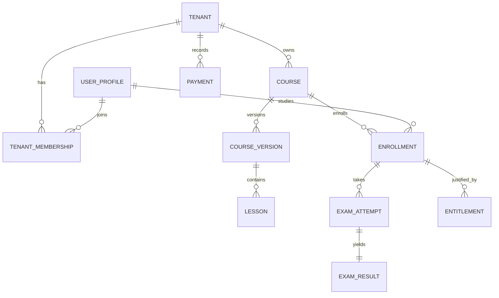

# Entity relationships

This is the logical model; see [DATA-MODEL.md](../../05-data/data-model.md) for ownership and [DATABASE-DESIGN.md](../../05-data/database-design.md) for physical constraints. Add detailed cardinality with the first migration.
