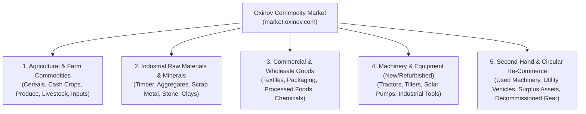

# Oxinov Commodity Market charter

**Status:** Draft. **Address:** `market.oxinov.com` (alias `commodity.oxinov.com`). **Pillars:** Oxinov Production & Trade / Oxinov AgriTech. **Origin:** Flo Softwares `comodity-market` (KrishiConnect) and `BT-Bazz-ComodityMarket-server`, expanded into an all-commodity, equipment, and circular re-commerce marketplace.

## Problem and vision

Traditional commodity trade and second-hand equipment transactions in Nepal and regional markets suffer from fragmented supply chains, opaque pricing, non-standardized quality grading, and significant transaction risk:
1. **Primary producers and raw commodity suppliers** face multi-tiered middlemen, depressed farmgate/depot prices, and delayed settlement.
2. **Commercial buyers, contractors, and processors** struggle to verify origin, volume, quality grades, and reliable delivery dates.
3. **Equipment owners, enterprises, and farmers selling or buying second-hand items** (such as tractors, power tillers, commercial vehicles, processing machinery, workshop tools, and surplus inventory) face rampant fraud, hidden defects, lack of warranty, and no secure payment escrow.

**Oxinov Commodity Market** provides a unified, verified B2B and B2C marketplace for:
- Raw agricultural, mineral, and industrial commodities.
- Commercial wholesale and manufactured bulk supplies.
- New, refurbished, and verified **second-hand equipment, commercial machinery, utility vehicles, and enterprise surplus**.

Transactions are protected by standardized condition grading, physical inspection protocols, transparent market price indices, and milestone escrow settlement via the Oxinov Platform Payments Ledger.

---

## Product range and catalog taxonomy

The marketplace organizes listings under five primary divisions:



### 1. Agricultural & Primary Commodities
- **Cereals & Grains:** Paddy, rice, wheat, maize, millet, barley.
- **Cash Crops & Plantations:** Orthodox and CTC tea, high-altitude coffee, large cardamom, ginger, turmeric, chili.
- **Pulses & Oilseeds:** Lentils (masoor, black gram), soybeans, mustard, sunflower seed.
- **Fresh Produce & Horticulture:** Bulk seasonal fruits, vegetables, garlic, onions, potatoes.
- **Livestock, Poultry & Dairy:** Cattle, goats, breeding pairs, commercial poultry, bulk milk, eggs.
- **Farming Inputs:** Certified seeds, organic fertilizers, bio-pesticides, animal feed lots.

### 2. Industrial Raw Materials, Minerals & Construction Commodities
- **Forestry & Timber:** Hardwood (sal, sissoo), softwood (pine), bamboo culms, sawn timber, wood chips.
- **Construction Aggregates:** Sand, river gravel, crushed ballast, quarry stone, bricks, slaked lime, bulk cement.
- **Scrap & Recyclable Metals:** Ferrous scrap (iron, steel rebar), non-ferrous scrap (copper wire, brass, aluminum sheets), industrial battery scrap.
- **Minerals & Clays:** Kaolin, limestone, dolomite, industrial silica.

### 3. Commercial Wholesale & Packaged Goods
- **Wholesale Food & Ingredients:** Refined flour, sugar bags, edible oils, bulk spices.
- **Textiles & Fibers:** Raw cotton, wool, jute fiber, unstitched fabric rolls, yarn cones.
- **Industrial Packaging:** Corrugated boxes, HDPE woven bags, gunny sacks, drum containers, glass jars.
- **Process Chemicals & Utilities:** Water treatment agents, dyes, food preservatives.

### 4. Machinery, Tools & Productive Assets (New & Refurbished)
- **Agricultural Equipment:** Power tillers, four-wheel mini tractors, combine harvesters, threshers, rice hullers, seed drills.
- **Water & Energy Systems:** Solar water pumping kits, drip irrigation sets, diesel pump sets, generator units.
- **Processing Plants:** Oil expellers, grain drying units, spice grinders, packaging sealers.
- **Commercial Workshop Gear:** Welding machines, lathe machines, heavy power tools, hydraulic presses.

### 5. Second-Hand Items, Pre-Owned Equipment & Re-Commerce (Circular Economy)
- **Pre-Owned Agricultural Machinery:** Used tractors, second-hand power tillers, reconditioned attachments (plows, rotavators, trailers).
- **Used Utility & Commercial Vehicles:** Light commercial vehicles (pickups, flatbed carriers), delivery vans, 3-wheel cargo loaders, farm trailers.
- **Refurbished Industrial & Processing Gear:** Reconditioned motors, pumps, packaging lines, compressors, grain cleaners.
- **Decommissioned Business & Surplus Assets:** Factory liquidation lots, surplus inventory batches, pallet racking, commercial kitchen gear, industrial generators.
- **Refurbished Enterprise & Farm Electronics:** Commercial solar inverters, deep-cycle battery banks, industrial scale systems, testing meters.

---

## Condition grading and verification system

To ensure buyer confidence across both fungible commodities and unique second-hand assets, listings enforce standardized grading standards:

### A. Raw and Agricultural Commodities
- **Grade 1 (Premium / Export Quality):** Verified moisture < 12%, minimal foreign matter (< 1%), uniform size/color, phytosanitary certified.
- **Grade 2 (Standard / Market FAQ):** Fair Average Quality for domestic wholesale trade.
- **Grade 3 (Commercial / Industrial Processing):** Suitable for milling, extraction, animal feed, or distillation.
- **Organic / Certified:** Requires verifiable cooperative certification or third-party organic lab documentation.

### B. Second-Hand, Equipment & Machinery Goods
Every second-hand or pre-owned item requires a mandatory condition disclosure score:
- **Brand New (Open Box):** Unused, original packaging, full remaining factory warranty.
- **Certified Refurbished:** Professionally inspected, serviced, worn parts replaced, minimum 30-day dealer warranty.
- **Used — Like New (Grade A):** Minimal operating hours/mileage, flawless mechanical/structural state, full service log.
- **Used — Good (Grade B):** Normal cosmetic wear, fully operational, recently tested, minor servicing due.
- **Used — Fair (Grade C):** Functional with known cosmetic defects or maintenance requirements clearly listed in description.
- **Salvage / For Parts or Scrap:** Non-operational, sold for scrap value, rebuilders, or spare part harvesting.

### Mandatory disclosures for second-hand items:
1. **Operating History:** Year of manufacture, odometer/hours reading, past major overhauls.
2. **Ownership & Title Proof:** Engine/chassis numbers, bluebook/registration status, VAT bill copy, and no-objection certificate (NOC) where applicable (prevents stolen/fenced property).
3. **Diagnostic Report / Video:** High-resolution photos from 6 standard angles, live video of engine/machine running, and condition checklist.
4. **Third-Party Inspection Option:** Buyers can order an on-site inspection by an Oxinov-approved depot technician prior to settlement.

---

## Transaction & listing modes

1. **Spot Fixed Price:** Direct buy-it-now for standardized quantities or individual equipment units.
2. **Volume-Tiered Wholesale:** Automated price tiers based on order volume (e.g. 1–5 tons @ Rs. 45/kg, 6–20 tons @ Rs. 40/kg).
3. **Request for Quote (RFQ) / Negotiated Bids:** Buyers submit target volumes, delivery destinations, and custom price proposals; sellers counter or accept.
4. **Surplus Lot Tender / Liquidation Auction:** Timed bidding for factory surplus batches, seasonal bulk harvests, or decommissioned fleet items.

---

## Milestone escrow payment workflow

To eliminate non-delivery and fraudulent condition claims, all high-value commodity and second-hand equipment transactions follow a milestone escrow workflow powered by the Oxinov Platform Payments Ledger:

```mermaid
sequenceDiagram
    autonumber
    actor Buyer
    participant Market as Commodity Market API
    participant Ledger as Platform Payments Ledger
    participant Gateway as Payment Gateway (Khalti/eSewa/Bank)
    actor Seller
    actor Inspector as Inspector / Courier

    Buyer->>Market: Places order / locks quotation
    Market->>Ledger: Create escrow transaction
    Ledger->>Gateway: Direct buyer payment
    Buyer->>Gateway: Authorizes payment
    Gateway-->>Ledger: Payment confirmed (server-to-server)
    Ledger-->>Market: Funds held in Escrow
    Market-->>Seller: Notify: Escrow secured; dispatch goods / vehicle
    Seller->>Inspector: Deliver item or transport with waybill
    Inspector-->>Buyer: Goods arrive at buyer location / depot
    Buyer->>Market: Acknowledges physical delivery
    Note over Buyer,Market: 48-Hour Inspection Window begins
    alt Inspection passes
        Buyer->>Market: Accepts condition / Release approval
        Market->>Ledger: Release escrow (settle to seller's bank or payment account minus commission)
        Ledger-->>Seller: Payout available
    else Inspection fails / Dispute raised
        Buyer->>Market: Raises dispute with condition photos / inspector report
        Market->>Market: Lock payout & escalate to Dispute Resolution
    end
```

---

## User roles and access model

All users authenticate through the unified Oxinov Identity (`id.oxinov.com`). Market roles map to platform trust levels:

| Role | Responsibilities | Required Trust Level | Mandatory Policy |
| :--- | :--- | :--- | :--- |
| **Market Visitor** | Search listings, browse commodity price tickers, read condition reports | T0 Visitor | None |
| **Member** | Save listings, track price alerts, calculate freight estimates | T1 Member | Oxinov Terms & Privacy |
| **Buyer / Trader** | Place orders, initiate RFQ negotiations, deposit escrow funds, review sellers | T2 Contact-verified | Payments, Escrow, Refunds, and Disputes Policy |
| **Individual Seller / Equipment Owner** | Sell farm produce, personal second-hand equipment, tools, or single utility vehicles | T3 Identity-verified (KYC) | Marketplace Seller Policy |
| **Commercial Dealer / Cooperative / Enterprise** | Sell wholesale commodities, bulk surplus lots, fleet vehicles, or run liquidation auctions | T4 Business-verified (PAN/VAT & Reg) | Marketplace Seller Policy |
| **Depot & Inspection Partner** | Perform mechanical checks, weighbridge verification, and issue inspection reports | T4 Certified Partner | Inspector Partner Agreement |
| **Oxinov Market Operations** | Moderate listings, review title disputes, arbitrate escrow, manage price feeds | Platform Admin | SOC & Operations Runbooks |

---

## Product plane architecture

Oxinov Commodity Market follows the standard product plane template:

| Layer | Repository Location | Runtime / Boundary |
| :--- | :--- | :--- |
| **Web Frontend** | `frontend/products/market-web/` | Next.js App Router at `market.oxinov.com` |
| **API Backend** | `backend/products/market-api/` | NestJS REST API with OpenAPI specification |
| **Background Worker** | `backend/products/market-worker/` | BullMQ worker: market price feeds, escrow timers, dispute SLAs |
| **Database** | `database/products/market/` | Dedicated PostgreSQL instance with RLS policies |
| **Domain Contracts** | `packages/contracts/market/` | Shared TypeScript interfaces, DTOs, and condition schemas |

### Shared platform dependencies (reused, not reinvented):
- **Identity & SSO:** `id.oxinov.com` (OIDC session, no local password storage).
- **KYC & Verification:** Platform KYC service (Citizenship, PAN/VAT, Bluebook/Ownership documents).
- **Payments and escrow:** Platform Payments Ledger (eSewa, Khalti, ConnectIPS, Bank Transfer).
- **Messaging:** Platform real-time conversation service for buyer-seller RFQs.
- **Media Storage:** Platform S3/MinIO bucket for listing photos, diagnostic videos, and inspection certificates.

---

## Regulatory & compliance requirements

1. **Nepal Consumer Protection Act 2075 & Draft E-Commerce Bill:** Mandatory disclosure of seller PAN/VAT, accurate pricing, return/refund terms, and transparent dispute resolution.
2. **Second-Hand Motor Vehicles & Heavy Machinery:** Compliance with Department of Transport Management (DoTM) rules; bluebook verification and ownership transfer documentation before final escrow release.
3. **Payment Escrow Governance:** Escrow funds are managed via authorized bank escrow/settlement accounts in compliance with Nepal Rastra Bank (NRB) Payment Systems Directives (no unauthorized stored-value wallet).
4. **Scrap, Forest & Mineral Transit:** Compliance with Department of Mines & Geology and Department of Forests regulations regarding domestic transport permits and transit pass checks.
5. **Anti-Fencing & Stolen Goods Prevention:** Immediate automated blacklisting of reported stolen serial/chassis numbers and police cooperation protocols.

---

## Success metrics

- Monthly Gross Merchandise Value (GMV) across raw commodities vs. second-hand equipment.
- Verified active sellers (farmers, cooperatives, equipment dealers, industrial suppliers).
- Average time from listing to sale by category.
- Escrow dispute rate (< 1.5% target).
- Inspection pass rate for second-hand items (> 92% target).
- Zero incidents of fraudulent title/stolen equipment listings.

---

## Release gate checklist

| Milestone Item | Status | Notes |
| :--- | :--- | :--- |
| Accountable Product Owner appointed | Pending | Required before implementation |
| Rebranded scope approved across platform blueprints | Completed | Expanded to all-commodity & re-commerce |
| Rights & IP confirmation for Flo Softwares reference models | Pending | Formal rights assignment |
| Nepal legal review on escrow and vehicle/second-hand sales | Pending | Retained legal counsel review |
| Commission structure and fee schedule finalized | Pending | Volume tiers & inspection fee model |
| Pilot districts & launch partner dealers/cooperatives identified | Pending | 2 agricultural districts + 1 machinery hub |
