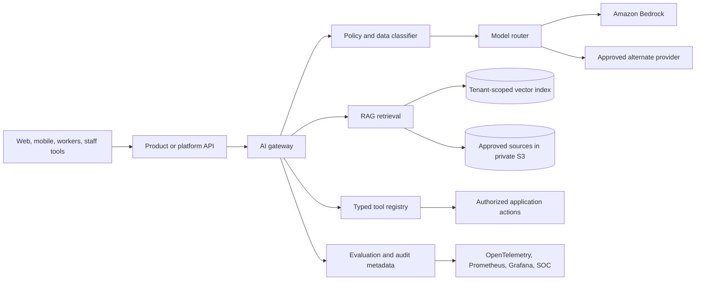

# AI platform architecture

## Decision

Create a shared `platform-ai` capability behind the Oxinov backend. All company and product applications use versioned internal APIs or typed application commands. The gateway initially uses Amazon Bedrock in AWS Mumbai (`ap-south-1`) through a provider adapter. It can add other providers without changing product domain logic.

The gateway is a module in the platform backend first. Extract it into a separately deployed service only when independent scale, availability, security boundaries, or team ownership require it.

## System boundary



Clients never hold provider credentials or call models directly. The product API establishes the authenticated person, organization, tenant, role, entitlements, trust level, and feature policy before the gateway runs.

## Gateway request path

1. Authenticate the calling service and propagate a trusted actor and tenant context.
2. Authorize the AI feature, product entitlement, role, and rate or budget limit.
3. Resolve the approved use-case policy and risk tier.
4. Classify the input and remove or reject secrets, prohibited data, active exam answers, and unsupported file types.
5. Load a versioned prompt by identifier; product code never concatenates uncontrolled system instructions.
6. Retrieve tenant- and product-scoped approved content when RAG is required.
7. Apply input guardrails and prompt-injection checks.
8. Route through a model alias using the approved region, provider, version, and cost profile.
9. Validate the response against a schema, citations, content policy, and output guardrails.
10. Return a draft or a proposed typed action. The owning application performs any permitted action after its own authorization and required human approval.
11. Record safe metadata, metrics, evaluation samples, and security events without raw private content.

## Logical components

| Component | Responsibility |
| --- | --- |
| Feature registry | Owner, purpose, risk tier, allowed data, languages, model alias, prompt, budgets, and release state |
| Policy engine | Tenant, role, plan, age, content, region, tool, and approval decisions |
| Data protection filter | Classification, minimization, secret detection, redaction, size limits, retention mode |
| Prompt registry | Immutable published versions, variables, change review, rollback, and evaluation link |
| Model router | Alias-to-provider mapping, timeout, retry, fallback, regional and quota policy |
| Guardrail adapter | Input and output safety, denied topics, sensitive information, and prompt-attack checks |
| Retrieval service | Source approval, indexing, tenant filters, freshness, citation metadata, and deletion |
| Tool registry | Typed allowlist, per-action authorization, parameter validation, idempotency, confirmation, and timeout |
| Response validator | JSON schema, citation requirements, policy checks, and safe failure |
| Evaluation service | Offline regression suites, sampled human review, launch thresholds, and drift checks |
| Usage ledger | Tokens, latency, model alias/version, feature, tenant, estimated cost, and budget decisions |
| Audit/SOC adapter | Approval and policy metadata plus normalized security events; no raw prompts |

## Provider and model policy

- Use Amazon Bedrock for initial text, embedding, vision, RAG, and guardrail workloads.
- Use model aliases in application code. Configuration maps aliases to exact provider models and inference profiles.
- Verify [model and Region support](https://docs.aws.amazon.com/bedrock/latest/userguide/inference-profiles-support.html) before each release.
- Use in-Region inference when available. Use an approved Asia Pacific geography profile only after documenting every possible processing Region.
- Do not use a global cross-Region inference profile for restricted or tenant-residency-controlled data without an explicit data and legal review. AWS explains the routing behavior in [cross-Region inference](https://docs.aws.amazon.com/bedrock/latest/userguide/cross-region-inference.html).
- Use application inference profiles and low-cardinality cost tags for product, feature, team, and environment. Never place email, name, prompt content, or another personal value in request metadata.
- Use SageMaker AI for validated trained models, batch inference, vision, anomaly detection, or MLOps. A custom model requires a model card, dataset lineage, evaluation, deployment owner, and rollback plan.

## RAG architecture

RAG is allowed only for an approved feature.

### Ingestion

1. Upload to a quarantined private S3 prefix.
2. Validate file type and size and scan for malware.
3. Record owner, copyright/licence, product, tenant, locale, sensitivity, version, effective date, expiry, and publication status.
4. Extract and chunk content using a versioned pipeline.
5. Generate embeddings through the gateway.
6. Write chunks into a product and tenant scoped index or namespace.
7. Publish the index version after validation; preserve deletion and re-index records.

### Retrieval rules

- Apply authorization before retrieval and enforce tenant/product filters in storage and query layers.
- Retrieve only content whose publication and effective-date status permits the use case.
- Learner tutoring uses published course content. Active assessments, hidden rubrics, answer keys, private chats, and other tenants' material are excluded.
- Return source ID, version, section, rights status, and citation span with each result.
- Treat retrieved text as untrusted data, not instructions.
- Test direct and indirect prompt injection, encoded instructions, malicious documents, and cross-tenant identifiers.

[Amazon Bedrock Knowledge Bases](https://docs.aws.amazon.com/bedrock/latest/userguide/kb-how-it-works.html) is an implementation option. Select the vector store only after expected corpus size, tenant model, filters, recovery, and cost are measured. Do not add pgvector merely because PostgreSQL is already present.

## Agent and tool safety

Tools are typed application operations, never raw SQL, shell, HTTP, secret-manager, or provider SDK access.

| Control | Requirement |
| --- | --- |
| Allowlist | Each use case names its permitted tools; default is none |
| Authorization | Re-check actor, tenant, role, policy, trust level, and entitlement for every call |
| Parameters | Validate a versioned schema; ignore model-supplied identity or tenant fields |
| Preview | Show the user the material action and affected objects before execution |
| Approval | Require explicit human approval for external communication, publishing, grading, account, money, or data changes |
| Idempotency | Require an idempotency key for state-changing calls |
| Boundaries | Limit steps, tokens, time, records, money, frequency, and recursion |
| Evidence | Save tool name, safe parameter summary, policy decision, approver, result code, and correlation ID |
| Recovery | Define cancellation, compensation, rollback, and a global kill switch |

The initial release exposes no state-changing tool to a model.

## Data, logging, and retention

- Do not use customer or employee content to train a shared model by default.
- Send only the minimum content required for the approved task.
- Keep model invocation logging disabled unless the owner approves a redacted, time-limited configuration. AWS states that invocation logging is disabled by default and, when enabled, can store full inputs and outputs in CloudWatch Logs or S3; see [model invocation logging](https://docs.aws.amazon.com/bedrock/latest/userguide/model-invocation-logging.html).
- Application telemetry records request/correlation ID, use case, model alias and version, prompt version, safe internal tenant key, token counts, latency, cost estimate, guardrail result, retrieval source IDs, tool decision, and approval result.
- Never log raw prompts or responses, secrets, personal identifiers, private messages, assessment answers, full retrieved chunks, or uploaded documents.
- Configure retention by data class. Evaluation samples require separate consent/approval, redaction, restricted access, and expiry.
- Confirm the selected model's retention mode before release using [Bedrock data retention](https://docs.aws.amazon.com/bedrock/latest/userguide/data-retention.html).

## Reliability and cost controls

- Set feature-level timeout, retry, circuit breaker, concurrency, input, output, and token limits.
- Fail safely to a non-AI workflow when a provider, guardrail, retriever, or validator is unavailable.
- Never retry a state-changing tool automatically without idempotency.
- Apply user, tenant, product, feature, and company budgets, including daily and monthly hard stops.
- Track token usage through the gateway and reconcile estimates with AWS Cost and Usage Reports.
- Keep a fallback model only after it passes the same evaluation and region/data rules.
- Cache only non-sensitive, deterministic, permission-equivalent results with bounded retention.

## Observability

Prometheus metrics use low-cardinality labels such as `environment`, `product`, `feature`, `model_alias`, `outcome`, and `risk_tier`. They never contain tenant ID, user ID, email, prompt text, document ID, or arbitrary error content.

Minimum metrics:

- request count, success, policy denial, guardrail block, validation failure, provider failure, and fallback;
- p50/p95 latency by gateway stage;
- input, output, cache-read, and cache-write tokens;
- estimated cost and budget denials;
- retrieval result count, empty retrieval, citation validation, and stale-source rejection;
- tool proposed, approved, denied, failed, and compensated;
- sampled evaluation pass rate by feature and locale.

Security detections consume normalized events such as prompt injection, tool authorization denial, suspected sensitive-data disclosure, budget abuse, and cross-tenant retrieval denial.

## Repository target

When Phase 1 implementation begins, use the existing company structure:

```text
backend/platform-api/src/modules/ai/
  application/
  domain/
  infrastructure/bedrock/
  infrastructure/evaluation/
  infrastructure/retrieval/
  infrastructure/telemetry/
packages/contracts/src/ai/
database/platform/migrations/
monitoring/grafana/dashboards/
security/soc/detections/sigma/
```

Do not create this implementation until the platform backend exists and the Phase 0 decisions in the [AI roadmap](../11-planning/ai-roadmap.md) are approved.

