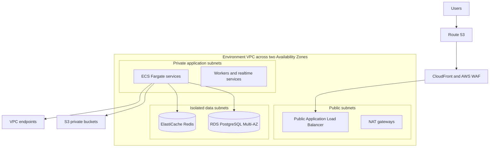

# AWS cloud architecture

**Status:** Current · **Owner:** Engineering lead · **Last reviewed:** 2026-09-29

## Decision

AWS is the production cloud for Oxinov Platform. Use Asia Pacific Mumbai (`ap-south-1`) as the primary region. Use Asia Pacific Hyderabad (`ap-south-2`) initially for encrypted backup copies and a documented recovery path; do not pay for active multi-region compute until recovery objectives or measured business risk require it.

The selection must still be verified with latency measurements from the networks used by target customers (the audience is global; CloudFront serves the website worldwide) before production launch. A material routing problem can change the primary AWS region through an ADR without changing the application architecture.

> **Launch hosting (ADR-017, ADR-018):** until a scale trigger in the [DevOps roadmap](../10-devops/devops-roadmap.md) is met, Oxinov runs on one k3s node on the starter server (`devops/terraform/environments/production/starter`), deployed with the shared Helm chart; runbook in `devops/kubernetes/README.md`. The layout below remains the target it moves to, with Amazon EKS as the runtime instead of ECS Fargate (ADR-018). What runs today, and which managed services wait for a trigger (Redis, Secrets Manager, staging, production Prometheus, WAF), is recorded in [CURRENT-STATE.md](current-state.md) and ADR-021; costs are in [cost optimization](../10-devops/cost-optimization.md).

## AWS account structure

Use AWS Organizations and keep the management account for organization and billing administration. Workloads do not run in the management account.

| Account | Purpose |
| --- | --- |
| Management | AWS Organizations, consolidated billing, and account creation only |
| Security and log archive | Organization CloudTrail, AWS Config, GuardDuty/Security Hub administration, protected logs, and security evidence |
| Shared services | DNS delegation, approved CI/CD integrations, shared image replication, and central operational tooling where justified |
| Development | Developer integration workloads and disposable test infrastructure |
| Staging | Production-like release, recovery, load, security, and payment-mode testing |
| Production | Customer-facing company platform and product workloads |

If the initial budget cannot support every workload account, development and staging may begin in one non-production account with separate VPCs and permissions. Production and the security/log archive remain separate accounts.

## Regions and recovery

| Function | Region | Initial mode |
| --- | --- | --- |
| Primary application and data | `ap-south-1` Mumbai | Active |
| Disaster-recovery backup copy | `ap-south-2` Hyderabad | Encrypted backups and recovery automation |
| Global delivery | CloudFront edge network | Active |

Define recovery time and recovery point targets before choosing warm standby or active multi-region services. Test restoration into an isolated recovery VPC at least quarterly before launch commitments depend on it.

## VPC plan

Use one VPC per environment and non-overlapping address ranges.

| Environment | CIDR | Account |
| --- | --- | --- |
| Development | `10.40.0.0/16` | Development |
| Staging | `10.30.0.0/16` | Staging |
| Production | `10.20.0.0/16` | Production |
| Recovery | `10.60.0.0/16` | Production or dedicated recovery account |

Each production and staging VPC uses at least two Availability Zones and three subnet tiers per Availability Zone:

1. **Public:** internet-facing Application Load Balancer and NAT gateway only.
2. **Private application:** ECS Fargate tasks, Keycloak if self-hosted, workers, realtime services, and internal load balancers.
3. **Isolated data:** RDS PostgreSQL and ElastiCache Redis with no direct route to the internet.

Development can use fewer resources to reduce cost, but its CIDR and security-group design must remain compatible with the production Terraform modules.

## Service mapping

| Platform responsibility | AWS service |
| --- | --- |
| DNS and certificates | Route 53 and AWS Certificate Manager |
| CDN and edge protection | CloudFront, AWS WAF, and Shield Standard |
| Container registry | Amazon ECR with immutable tags and image scanning |
| Initial container runtime | Amazon ECS on Fargate |
| Later Kubernetes option | Amazon EKS after an approved scale or team-ownership decision |
| Transaction database | Amazon RDS for PostgreSQL; Multi-AZ in production |
| Cache and realtime fanout | Amazon ElastiCache for Redis-compatible workloads |
| Object storage and backup copies | Amazon S3 with versioning, encryption, lifecycle rules, and blocked public access |
| Secrets and encryption | AWS Secrets Manager, Systems Manager Parameter Store for non-secrets, and AWS KMS |
| Email candidate | Amazon SES after sender-domain and delivery review |
| Queue option | Existing Redis/BullMQ first; Amazon SQS for AWS-native decoupled jobs when justified |
| Generative AI | Amazon Bedrock through the Oxinov AI gateway; Guardrails, evaluation, tagged inference profiles, and Knowledge Bases only for approved use cases |
| Custom and predictive ML | Amazon SageMaker AI for approved training and MLOps; AWS IoT Greengrass for approved edge inference |
| Metrics and dashboards | OpenTelemetry, Amazon Managed Service for Prometheus, and Amazon Managed Grafana, or a documented compatible deployment |
| Logs and audit | Structured application logs, CloudWatch Logs, organization CloudTrail, and protected S3 log archive |
| Security posture | IAM Identity Center, GuardDuty, Security Hub, AWS Config, Inspector, WAF, and the separate SOC/SIEM pipeline |

## Security controls

- No public IP addresses on application tasks, databases, caches, workers, or identity servers.
- Use security-group references between tiers. Do not authorize database access by broad CIDR ranges.
- Use ECS task roles and workload credentials; do not store long-lived AWS access keys in applications or CI.
- Use GitHub Actions OpenID Connect for short-lived deployment credentials with environment-specific roles and approval gates.
- Use Systems Manager Session Manager for approved administration; do not expose SSH or permanent bastion hosts.
- Enable organization CloudTrail, GuardDuty, AWS Config, Security Hub, VPC Flow Logs, ECR scanning, S3 public-access blocks, and KMS encryption.
- Place production database credentials in Secrets Manager and rotate them through a tested procedure.
- Restrict administrative access with MFA, least privilege, separation of duties, and audited emergency access.
- Forward normalized application security events to the existing SIEM. Operational AWS logs do not replace the SOC event contract.
- Restrict Bedrock and SageMaker access to dedicated workload roles used by the AI gateway or approved ML pipelines. Browser/mobile clients and ordinary product tasks receive no model-provider permission.
- Default AI processing to approved in-Region models. Record and approve all Regions in any cross-Region inference profile before restricted data is allowed.
- Keep Bedrock model invocation logging disabled unless a reviewed redacted and time-limited use case requires it; application logs remain metadata-only.

## Connectivity and cost controls

- Create gateway or interface VPC endpoints for S3, ECR, Secrets Manager, CloudWatch, and other heavily used AWS services where the endpoint is cost-effective.
- Use one NAT gateway per active Availability Zone in production. Development may use one NAT gateway and scheduled shutdown when the reduced availability is documented.
- Do not add Transit Gateway, Direct Connect, service mesh, or cross-region active traffic until a measured requirement exists.
- Set AWS Budgets, cost-anomaly detection, mandatory cost-allocation tags, log-retention limits, non-production schedules, and per-environment cost dashboards before shared use.
- Required tags include `Environment`, `Product`, `Service`, `Owner`, `CostCenter`, `DataClass`, and `ManagedBy=Terraform`.

## Terraform delivery order

1. Bootstrap remote Terraform state, locking, KMS keys, and deployment roles.
2. Create AWS Organizations policies and workload accounts.
3. Create environment VPCs, subnets, routes, endpoints, flow logs, and security groups.
4. Create ECR, ECS, load balancers, Route 53, CloudFront, WAF, and certificate resources.
5. Create RDS, ElastiCache, S3, secrets, backups, and alarms.
6. Add observability, security services, CI federation, deployment, and rollback automation.
7. Add Bedrock inference profiles, AI gateway permissions, Guardrails, quotas, budgets, evaluation assets, and monitoring only after the AI Phase 0 gate.

No Terraform apply targets production until peer review, a saved plan, security checks, budget alarms, state backup, change approval, and rollback or replacement steps exist.

## References

- [AWS VPC planning](https://docs.aws.amazon.com/vpc/latest/userguide/vpc-getting-started.html)
- [AWS Regions and Availability Zones](https://docs.aws.amazon.com/global-infrastructure/latest/regions/aws-availability-zones.html)
- [Amazon ECS on AWS Fargate](https://docs.aws.amazon.com/AmazonECS/latest/developerguide/AWS_Fargate.html)
- [Amazon RDS for PostgreSQL](https://aws.amazon.com/rds/postgresql/)
- [Amazon RDS Multi-AZ](https://aws.amazon.com/rds/features/multi-az/)
- [GitHub Actions OIDC with AWS](https://docs.aws.amazon.com/IAM/latest/UserGuide/id_roles_providers_create_oidc.html)
- [Amazon Bedrock documentation](https://aws.amazon.com/documentation-overview/bedrock/)
- [Amazon Bedrock cross-Region inference](https://docs.aws.amazon.com/bedrock/latest/userguide/cross-region-inference.html)
- [Amazon SageMaker AI MLOps](https://docs.aws.amazon.com/en_en/sagemaker/latest/dg/mlops.html)
