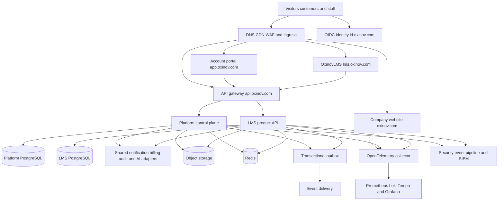

# Oxinov company platform architecture

## Architecture choice

Build a multi-product platform with a shared control plane and independently owned product planes. Start as a modular monorepo with a small number of deployable applications. Preserve module and data boundaries so a high-growth product can be extracted without redesigning every product.

## Shared control plane

The control plane owns:

- identity links and user profiles;
- organizations, memberships, invitations, and organization roles;
- product catalogue, plans, subscriptions, and entitlements;
- provider-neutral billing records and verified payment events;
- notification preferences and delivery requests;
- consent, privacy requests, support cases, audit events, and staff access;
- feature flags and product availability by market;
- the account portal and product launcher.

It does not own product-specific authoring, learning, examinations, robot control, media production, agricultural operations, or research workflows.

## Product planes

Each product plane owns its frontend, API modules, workers, database migrations, product authorization, product audit events, runbooks, dashboards, and release lifecycle. OxinovLMS retains its current tenant model: LMS workspaces belong to platform organizations or individual owners, while courses and learner data remain in the LMS database boundary.

## Identity and authorization

Use OpenID Connect for single sign on. The identity provider proves who the user is; the platform database decides organization membership, product entitlement, and product roles. Access tokens use short lifetimes and an intended audience. Services validate issuer, audience, signature, expiry, and required scopes.

Keycloak is the default identity implementation because it supports OIDC, SSO, organizations, identity brokering, MFA, and container deployment. Keep the application integration provider-neutral so a managed OIDC provider can replace it through an architecture decision. Production Keycloak must use high availability, backed-up PostgreSQL, restricted administration, TLS, monitoring, and tested recovery; use a managed service if the team cannot operate that safely.

## Data ownership

- Use one PostgreSQL cluster initially, with separate databases or strictly owned schemas for the platform and each product.
- A service account can access only its owned database or schema.
- Tenant-owned product records carry an immutable tenant or organization identifier and use application authorization plus PostgreSQL row-level security where suitable.
- Cross-product references use stable public IDs. Database foreign keys do not cross product database boundaries.
- Files live in private S3-compatible object storage with product-prefixed buckets or access points and short-lived signed URLs.
- Redis stores rebuildable cache, rate-limit, queue, and realtime delivery state only.
- Analytics, observability, and security stores are separate from transactional databases.

## API and event integration

- External APIs use versioned REST and OpenAPI first.
- Frontends call the gateway or their product API; they never connect to PostgreSQL.
- Product access is checked using a control-plane entitlement API with bounded caching and explicit revocation handling.
- State changes that other modules need are written to a transactional outbox in the same database transaction.
- Begin with an outbox worker and idempotent consumers. Add NATS JetStream only when several independent consumers or higher event throughput justify it.
- Every event has an ID, version, timestamp, producer, subject, correlation ID, organization context when applicable, and a schema owned in `packages/contracts`.
- Do not create synchronous chains across several services for a single customer request.

## Payments

Use a payment-provider adapter and one internal order, payment, refund, subscription, and entitlement ledger. For a Nepal-registered operating entity, evaluate Khalti and eSewa first. Stripe must not be assumed because Nepal is not listed as a directly supported Stripe business location as of September 2026. A callback or browser redirect never grants an entitlement; the backend verifies the payment with the provider and processes the provider event idempotently.

## Deployment evolution

1. **Local development:** Docker Compose for PostgreSQL, Redis, object storage, identity, observability, and application containers.
2. **Initial production:** managed PostgreSQL and object storage with a small managed container platform or managed Kubernetes only if the team can operate it.
3. **Growth:** Kubernetes namespaces by environment and product, autoscaling, network policies, workload identity, secret manager, managed backups, and independent product deployments.
4. **Regulated or high-scale products:** dedicated accounts/projects, clusters, databases, keys, regions, or networks where risk and regulation require them.

Kubernetes is a deployment target, not a requirement for the first customer. The production decision must include staffing, cost, recovery, and security ownership.

## Observability and security

- Instrument applications with OpenTelemetry and propagate trace and correlation IDs.
- Use Prometheus and Alertmanager for metrics and alerts, Loki for operational logs, Tempo for traces, and Grafana for dashboards.
- Keep the existing SOC pipeline separate: normalized security events go to the SIEM and Sigma detections; Falco covers production container runtime threats.
- Never place passwords, tokens, private messages, raw prompts, payment secrets, or exam answers in logs, traces, metrics, or security events.
- Define service-level objectives for the portal, identity, gateway, and each production product.

## Failure boundaries

- A failure in a future product must not prevent customers from signing in to the portal or using OxinovLMS.
- The portal can display a product as unavailable without calling the product database.
- Notification, analytics, and audit delivery use queues and retries; their temporary failure must not duplicate payments or corrupt product state.
- Identity and entitlement outages use documented fail-closed or limited-session behavior based on the operation's risk.
