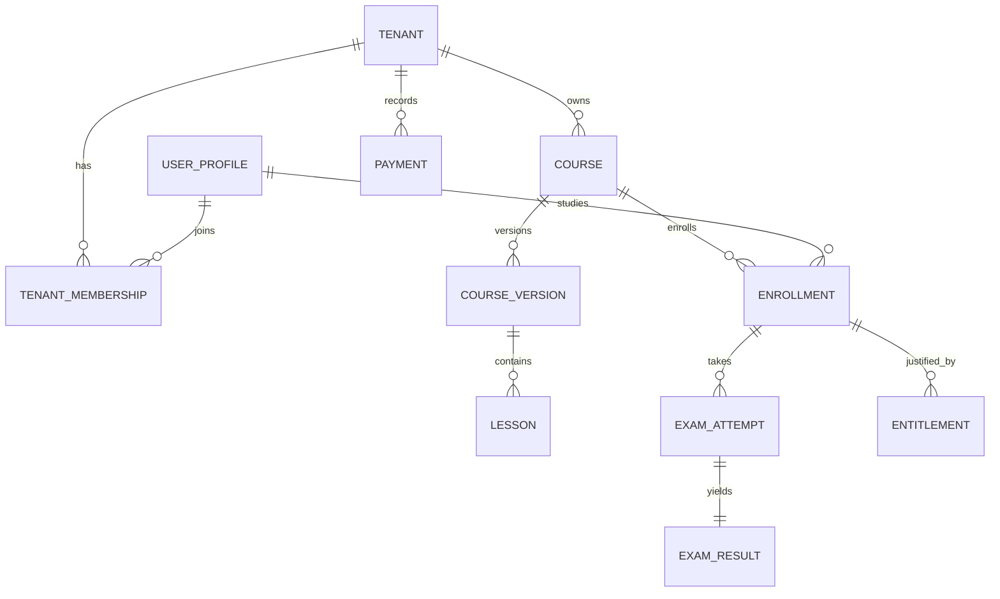

# Entity relationships

This is the logical model; see [DATA-MODEL.md](DATA-MODEL.md) for ownership and [DATABASE-DESIGN.md](DATABASE-DESIGN.md) for physical constraints. Add detailed cardinality with the first migration.
